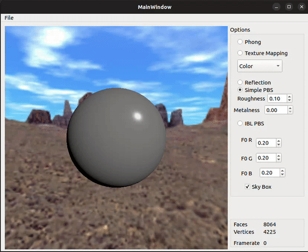

  <h3 align="center">A Physically Based Renderer</h3>

  

    A gentle introduction to OpenGL rendering, from basic visualization to Image Based Lighting (IBL).
  

  
   

  

    
    
    
    
  

## 📋 <a name="table">Table of Contents</a>
1. 🤖 [Introduction](#introduction)
2. ⚙️ [How to run](#how-to-run)
3. 📸 [Basic Vizualization](#basic-vizualization)
4. 💡  [Physically Based Rendering](#pbr)
5. 🖼️ [Image Based Lighting](#ibl) 

## <a name="introduction">🤖 Introduction</a>
Developed using C++ inside QtCreator 5 and OpenGL as the rendering backend, as part of the Fast Realistic Rendering (FRR) course. This project's goal is to teach students some basic rendering techniques, ranging from simple topics like Phong lighting to more advanced techniques like Physically Based Rendering. 

## <a name="how-to-run">⚙️ How to run</a>
**Prerequisites**
Make sure you have the following installed on your machine:
- [Ubuntu Linux] (https://ubuntu.com/) (Operating System)
- [QtCreator 5] (https://doc.qt.io/qt-5/gettingstarted.html)

**Running the project**
- Open ViewerPBS23.pro
- Compile & run

## <a name="basic-vizualization">📸 Basic Vizualization</a>
**Vizualization of a sphere at the center of a cubemap.**
- Phong lighting on a sphere (colored or textured sphere)
- Cubemap / Skybox
- Reflection

Scene cubemap downscaled   |  Reflection
:-------------------------:|:-------------------------:
  |  

## <a name="pbr">💡 Physically Based Rendering</a>
**Bi-directional Reflectance Distribution Function (BRDF)**
- Using the Schlick approximation of the Fresnel factor 
- Using the GGX/Trowbridge-Reitz function as Normal Distribution
- Using the Schlick-GGX model as Geometry Shadowing Function
- Using the Cook-Torrance equation to compute the specular part
- Changing the roughness and metalness (using global values from the UI or via textures/maps)
- (Limitations corrections) HDR Tone Mapping, Gamma Correction

Using global values        |  Using simple pbs material
:-------------------------:|:-------------------------:
  |  

## <a name="ibl">🖼️ Image Based Lighting</a>
**Environment mapping for more physically accurate vizualization.**

**Diffuse Irradiance:**
- Using another Schlick approximation of the Fresnel factor that takes roughness into account
- Using a pre-filtered environment map (given, already convoluted)

**Specular Radiance:**
- Using OpenGL's built-in Mipmaps to get the different Levels Of Detail (LODs)
- Using the Epic Games' pre-computed BRDF integration map
- (Limitations corrections) HDR Tone Mapping, Gamma Correction

Image based lighting using global values|
:-------------------------:|
|
